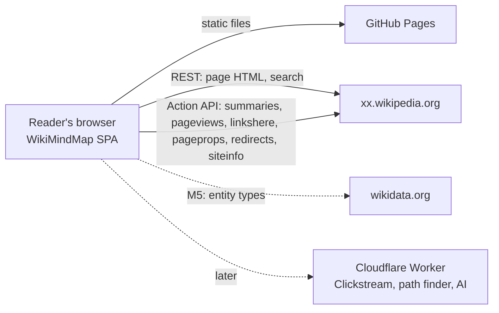

# Architecture

WikiMindMap 2027 is a **static single-page app**. The browser talks directly to the public Wikimedia APIs, and there is no server of our own in the MVP. Everything that decides *what* a map shows is plain TypeScript, separate from how it is drawn. That lets lenses be added one at a time.

## 1. Goals and constraints

| Goal | Consequence |
|---|---|
| Nothing to maintain (this is what ended the 2007 version) | Static hosting on GitHub Pages, no backend in the MVP |
| Fast: a map within ~1 s from cache, ~2.5 s cold | One request for the article structure, batched follow-ups, local cache |
| Lenses can be added one by one | Lens = pure function with a declared data need; shared layouts and renderer |
| Desktop first, keyboard and screen readers; tablets work, phones are nice to have | Full-window SVG map with pan and zoom, plus an outline view generated from the same graph (see `styleguide.md`) |
| Well-behaved Wikimedia client | Identifying header, batching, concurrency limit, caching |
| Vibe-coding friendly | Mainstream stack (React, TypeScript), strict boundaries, tests on real fixtures |

## 2. System context



All Wikimedia endpoints allow anonymous cross-site reads:
- **Action API** (`/w/api.php`): add `origin=*` to every request.
- **REST API** (`/w/rest.php/v1/…`): sends CORS headers for any site.

Requests are read-only and carry no cookies.

## 3. The pipeline

```
sources ──► Article ──► Lens.build() ──► MapGraph ──► Layout ──► PositionedMap ──► Renderer (SVG / outline)
(network)    (core)      (lenses/)        (core)       (layouts/)    (core)             (ui/map/)
                ▲
          Enrichments (pageviews, kinds, linksHere…) loaded on demand, based on lens.needs
```

1. **Sources** fetch and normalize raw API data. Only this layer knows URLs and response formats.
2. **Article** is the normalized model: the section tree, the link occurrences per section, and the lead text (see `datamodel.md`).
3. **Enrichments** are optional data sets keyed by title. They are loaded only when the active lens declares a need for them.
4. **Lens** is `build(article, enrichments, options) → MapGraph`. It is pure and deterministic, so it can be tested with fixtures.
5. **Layout** is `layout(graph, viewport) → PositionedMap`, with x/y for every node and a path for every edge. Several lenses share one layout.
6. **Renderer** is React components that draw a `PositionedMap` as SVG, plus `OutlineView`, which draws the same `MapGraph` as nested lists.

### Lens and layout matrix

| Lens | Milestone | Data needs | Layout |
|---|---|---|---|
| Chapters | M2–M4 (MVP) | `sections`, `linksBack` | `mindmapTree` (two-sided tidy tree) |
| Kinds | M5 | `sections`, `linksBack`, `pageviews`, `kinds` | `mindmapTree` |
| Links in / out | M6 | `sections`, `pageviews`, `linksHere` | `bipolar` |
| Metro | M7 | `sections`, `linksBack` | `metroLines` |

## 4. Data sources

Every URL below is built in `src/sources/`. The `{lang}` is the Wikipedia language code (`en`, `de`, …).

| Need | Endpoint | Notes |
|---|---|---|
| Article structure and links | `GET https://{lang}.wikipedia.org/w/rest.php/v1/page/{title}/html` | Parsoid HTML, one request. `<section data-mw-section-id>` gives the chapter tree; `a[rel="mw:WikiLink"]` gives the links; `typeof="mw:Transclusion"` marks content from templates. |
| Search suggestions | `GET /w/rest.php/v1/search/title?q={q}&limit=8` | Title, short description, thumbnail |
| Preview card | `action=query&prop=extracts|pageimages|description&exintro=1&explaintext=1&exsentences=3&piprop=thumbnail&pithumbsize=320&redirects=1&titles=…` | Short description, plain-text lead (up to 3 sentences) and thumbnail. Loaded when a card opens; batchable up to 20 titles (the `exintro` limit). Chosen in M0 over `/api/rest_v1/page/summary` (see §13). |
| Redirects and normalization | `action=query&redirects=1&titles=A|B|…` | 50 titles per request. Only for link targets that Parsoid marks as redirects (`class="mw-redirect"`), to deduplicate leaves. Recentering on a redirect title needs no lookup: `rest.php` answers with a 307 to the target. |
| Links back (direction symbols) | `action=query&prop=links&titles=A|B|…&pltitles={center}|{its redirects}&pllimit=max&redirects=1` | 50 leaf titles per request, only for visible leaves not checked yet. Returns, for each leaf, whether it links to the center. Follow `plcontinue`. Gives the *both ways* symbol. Many articles link to the center through a redirect ("Mind-map"), so `pltitles` also holds the center's redirects (`prop=redirects&rdnamespace=0`, up to 49); `redirects=1` resolves leaf titles that are redirects. |
| Wikipedia languages (US-09) | `https://meta.wikimedia.org/w/api.php?action=sitematrix&smtype=language` | Every open Wikipedia; the language is the subdomain of the site URL. Cached 7 days. |
| Same article in another language | `action=query&prop=langlinks&titles={title}&lllang={lang}` | Switching language on a map; the start page in languages other than en/de/fr |
| Namespaces | `action=query&meta=siteinfo&siprop=namespaces|namespacealiases` | Once per language, cached 7 days. Filters out `File:`, `Kategorie:` and so on. |
| Page views (M5) | `action=query&prop=pageviews&titles=…&pvipdays=30&redirects=1` | 50 titles per request, **one batch at a time** (parallel requests get HTTP 429, found in TS-14); sum the daily values. Follow `pvipcontinue`: one response fills only part of a 50-title batch. |
| Wikidata IDs (M5) | `action=query&prop=pageprops&ppprop=wikibase_item&titles=…` | 50 per request |
| Entity types (M5) | `https://query.wikidata.org/sparql?format=json&query=SELECT ?item ?class WHERE { VALUES ?item { wd:Q… } ?item wdt:P31 ?class }` | P31 (instance of) only, 50 items per query, one query at a time; CORS allows `Api-User-Agent`. Map each class to a kind with `lenses/kindMap.json`. Owner decision in M5: `wbgetentities&props=claims` returns every statement (~4 MB per 50 items). |
| Incoming links (M6) | `action=query&list=backlinks&blnamespace=0&blfilterredir=nonredirects&bltitle=…&bllimit=500` | Page through the results up to a cap of 2,000 and show "2,000+" beyond that |

### Why Parsoid HTML, not wikitext or the rendered page

- **Wikitext** doesn't contain the links that templates produce (`{{Main|…}}`, infoboxes, navigation boxes). Parsing it correctly means reimplementing MediaWiki's parser.
- **The rendered page HTML** (what readers see) changes with the skin. Scraping it is what made the 2007 version fragile.
- **Parsoid HTML** follows a documented, versioned specification (the *MediaWiki DOM Spec*) and marks sections, links and templates explicitly. It's what Wikipedia's visual editor and mobile apps are built on.

To keep the risk contained:
- Only `src/sources/parsoid.ts` reads the HTML.
- The spec version is read from the `Content-Type` profile, and a warning is logged if it's newer than the version we tested.
- Tests run on about 20 recorded articles in `en` and `de`.
- **Fallback:** if parsing fails, fetch `action=parse&prop=tocdata|revid|displaytitle` and then `action=parse&oldid={revid}&section=N&prop=links` for each section. This is slower but gives the same `Article`, with every link as `body`. (`prop=sections` is deprecated in favour of `prop=tocdata`; found in TS-07.)

### API etiquette

- Header on every request: `Api-User-Agent: WikiMindMap/2027 (https://github.com/nyfelix/wikimindmap-next)`.
- At most 4 concurrent requests. Title lookups are batched 50 per request.
- Cache first (see §6). There's no automatic polling or prefetching beyond the visible map.
- On HTTP 429 or 503: back off exponentially (1 s, 2 s, 4 s), then show an error with a retry button.

## 5. Stack

| Area | Choice | Reason |
|---|---|---|
| Language | TypeScript (strict) | Clear contracts between layers; fewer AI coding mistakes |
| Build | Vite | Fast, simple static output |
| UI | React 19 | Best supported by AI coding tools, large ecosystem |
| Routing | React Router (library mode) | Well known; path-based URLs |
| Server state | TanStack Query | Caching, retries, request deduplication |
| Persistent cache | TanStack Query persister on IndexedDB (`idb-keyval`) | Instant back navigation and repeat visits |
| Tree layout | `d3-hierarchy` (this module only) | Proven tidy-tree algorithm |
| Animation | CSS transitions; Motion (`motion`) for the recenter move if CSS isn't enough | Recentering is the signature moment |
| Styling | Plain CSS with custom properties (`tokens.css`), CSS Modules per component | Custom design; fonts must stay swappable |
| Unit tests | Vitest + happy-dom (for `DOMParser`) | Fast, Vite-native |
| End-to-end | Playwright, with the network mocked from fixtures | Real browser, no live API |
| Lint/format | ESLint (typescript-eslint, react-hooks) + Prettier | Standard |
| CI/CD | GitHub Actions → GitHub Pages (`actions/deploy-pages`) | Free, same place as the code |

Not used, on purpose: no state library (URL + React state + Query are enough), no UI kit (the design is custom), no Tailwind (tokens come from the concept), no D3 beyond `d3-hierarchy` until the network lens needs `d3-force`.

## 6. Caching

| Data | Key | Lifetime |
|---|---|---|
| Article (parsed) | `article:{lang}:{title}` (also under the real title after a redirect) | 24 h |
| Redirects of an article's flagged links | `redirects:{lang}:{title}` | 24 h |
| Redirects to an article (for links back) | `aliases:{lang}:{title}` | 7 days |
| Links back to an article | `linksBack:{lang}:{title}`, growing as more leaves are checked | 24 h |
| Summary | `summary:{lang}:{title}` | 24 h |
| Siteinfo namespaces | `siteinfo:{lang}` | 7 days |
| Page views of an article's links | `pageviews:{lang}:{title}` | 24 h |
| Kinds of an article's links (Wikidata) | `kinds:{lang}:{title}` | 7 days |
| linksHere | `linksHere:{lang}:{title}` | 24 h |

Keys and lifetimes live in `src/ui/data/queries.ts`; there is one persister per lifetime (`src/ui/data/cache.ts`). The article key has no revision, because the revision is only known after loading; a cached article is refreshed after 24 h.

The cache is stored in IndexedDB and cleared when the cache schema version changes. If storage is unavailable (private mode), the app keeps working with an in-memory cache.

## 7. Routing and hosting on GitHub Pages

- **URLs:** `/{lang}/{Title}` with an optional query string, for example `/en/Mind_map?lens=chapters&density=4`. `/` is the start page: the map of "Mind map" in the reader's language (see `datamodel.md` §8).
- **Deep links:** GitHub Pages has no rewrites. The build therefore copies `index.html` to `404.html`, so deep links load the app, which reads the path.
  - *Trade-off:* the first response for a deep link has HTTP status 404. Browsers don't care, but link-preview bots may. Accepted for the MVP. A custom domain on Cloudflare fixes it later.
- **Base path:** `vite.config.ts` reads `BASE_PATH`. The site runs on the custom domain **wikimindmap.net** (GitHub Pages, `CNAME` in the repository root), so the workflow builds with `BASE_PATH=/`. On a plain `github.io` project page it would be `/wikimindmap-next/`.
- **Deploy:** push to `main`, then the GitHub Action runs `check`, `build` and deploys to Pages.

## 8. Module layout

```
.devcontainer/          dev container for VS Code (see §14)
src/
  core/                 pure types and helpers (no DOM, no fetch)
    types.ts            Article, MapGraph, PositionedMap… (see datamodel.md)
    titles.ts           title normalization, url ↔ title
    housekeeping.ts     "See also", "References"… per language
  sources/              the only code that talks to the network
    http.ts             fetch wrapper: header, origin=*, concurrency, retries
    parsoid.ts          Parsoid HTML → Article (DOMParser passed in)
    parseFallback.ts    action=parse fallback → Article
    search.ts, summary.ts, siteinfo.ts, redirects.ts
    pageviews.ts, wikidata.ts, linksHere.ts     (M5, M6)
  lenses/
    index.ts            registry: id → Lens
    chapters.ts         M2
    kinds.ts, kindMap.json                      (M5)
    links.ts                                    (M6)
    metro.ts                                    (M7)
  layouts/
    mindmapTree.ts      M2
    bipolar.ts          M6
    metroLines.ts       M7
  ui/
    App.tsx, routes.tsx
    search/             SearchBox, suggestions
    map/                MapView, SvgMap, nodes, RecenterButton, OutlineView
    panels/             PreviewCard, Trail, LensSwitch, Settings
    hooks/              useArticle, useEnrichments, useMapState
    styles/tokens.css   from concepts/assets/lens.css
  main.tsx
public/
  logo.svg, favicon.svg generated by scripts/build-logo.ts (styleguide.md §9)
scripts/
  record-fixture.ts     npm run fixtures -- en "Mind map"
  build-kind-map.ts     M5: builds lenses/kindMap.json from Wikidata SPARQL
tests/
  fixtures/{lang}/{Title}/   page.html, summary.json, redirects.json… (see datamodel.md §9)
  unit/                 parsoid, lenses, layouts
  e2e/                  Playwright specs
concepts/               lens previews (reference only)
```

Dependency direction (enforced by ESLint `no-restricted-imports`):

```
ui ──► lenses, layouts, sources, core
sources ──► core
lenses ──► core
layouts ──► core
core ──► (nothing)
```

## 9. Rendering

- **SVG**, one `<svg>` with a `viewBox` taken from the layout. Up to ~200 nodes is comfortably fast, so no Canvas is needed.
- **Nodes** are real focusable elements (`role="button"`) with labels. The ⊕ recenter control is a separate button.
- **Recenter animation:** nodes keep stable IDs (the target title). When the new map shares nodes with the old one, they move to their new place. Old nodes fade out and new ones fade in. Duration 450 ms, and none with `prefers-reduced-motion`.
- **Outline view:** the same `MapGraph` rendered as nested `<ul>`. It's the default for screen readers, and a toggle for everyone else.
- **Canvas:** the SVG fills the window. Pan and zoom are a transform on one root group; fit-to-window runs after every new map. Floating panels, callouts and the preview card are HTML above the SVG (see `styleguide.md` §2–§3).
- **Folding:** a shared fold toggle on every node with children, for every lens.
- **Direction symbols:** a shared `DirectionGlyph` component (`styleguide.md` §5).
- **Screen sizes:** desktop first (≥ 1024 px). Tablets work; phones are nice to have (`styleguide.md` §13).

## 10. Quality

| Area | Target |
|---|---|
| Performance | Map visible in < 1 s from cache and < 2.5 s cold on 4G, for a 10,000-word article |
| Bundle | < 200 kB gzipped initial JS |
| Accessibility | WCAG 2.2 AA: keyboard path through search → map → preview → recenter; visible focus |
| Browsers | Last 2 versions of Chrome, Safari, Firefox and Edge; iOS Safari 17+ |
| Tests | Every lens and layout has fixture-based unit tests; one e2e test per user-visible flow |
| Errors | Every failed request shows a message with a retry, never a blank map |

## 11. Security and privacy

- No accounts, no cookies, no analytics in the MVP. Nothing leaves the browser except Wikimedia API requests.
- No secrets in the frontend, ever. AI features (later) go through a Worker that holds the key.
- Article HTML is parsed with `DOMParser` into an inert document and never inserted into the page. Only extracted strings are rendered, as text.

## 12. Later (not in the MVP)

| Feature | Needs |
|---|---|
| Reader clicks lens (Clickstream) | A Cloudflare Worker plus storage with monthly preprocessed Clickstream data |
| Path finder, "why is this linked?" | A Worker (link graph search), optionally the Claude API for explanations |
| Custom domain (wikimindmap.org) | DNS, then move hosting to Cloudflare Pages to get proper deep-link status codes |
| Export (PNG, SVG, OPML, Markdown) | Frontend only, from `PositionedMap` and `MapGraph` |

## 13. API findings from the M0 spike

Checked on 2026-09-30 against `en`, `de` and `fr` (Mind map, Mindmap, Carte heuristique, World War II) with a throwaway script. CORS was checked by sending `Origin: https://nyfelix.github.io` and a preflight for `Api-User-Agent` from the container; a check from the deployed page follows in TS-03.

1. **Parsoid HTML and sections: confirmed.** `rest.php/v1/page/{title}/html` returns `200` with `Content-Type: text/html; charset=utf-8; profile="https://www.mediawiki.org/wiki/Specs/HTML/2.8.0"`, so the spec version we test against is **2.8.0**. Sections are real nested `<section data-mw-section-id="N">` elements (an `h3` section sits inside its `h2` section). The heading (`<h2 id="Background">`) is the first child of its section, with no wrapper. The revision is in the `ETag` (`W/"1374343935/…"`). No negative section IDs appeared, but the parser still handles them.
2. **CORS with `Api-User-Agent`: confirmed.** `rest.php` answers the preflight with `204`, `Access-Control-Allow-Origin: *`, and lists `Api-User-Agent` in `Access-Control-Allow-Headers`. `api.php?origin=*` answers with `200`, `*` and `api-user-agent`. The 307 redirect response also carries `Access-Control-Allow-Origin: *`, so `fetch` can follow it.
3. **Summary endpoint: use the Action API.** There is no core-REST equivalent (`rest.php/v1/page/{title}/bare` has no extract or thumbnail; `/description` and `/summary` return 404). `/api/rest_v1/page/summary` works and sends no deprecation header, but it is the legacy RESTBase layer, and it answered a short burst with HTTP 429 ("You are making too many requests"). `action=query&prop=extracts|pageimages|description` returns everything `Summary` needs, goes through the same `api.php` client as the other lookups, and can batch up to 20 titles.
4. **Red links and redirects in Parsoid HTML:**
   - A red link has `class="new"`, an `href` ending in `?action=edit&redlink=1`, and `typeof="mw:LocalizedAttrs"`. Strip the query from the `href` to get the target.
   - A link to a redirect page has `class="mw-redirect"` and the redirect title as its `href`, not the target. So the `redirects` lookup is needed **only for links marked `mw-redirect`**, not for every leaf (Mind map: 38 of 233 links).
   - Requesting a redirect title (`/page/Mindmap/html`) returns **307** with `Location: /w/rest.php/v1/page/Mind_map/html?redirect=no`. `fetch` follows it, and `response.url` gives the real title, so recentering and deep links need no extra lookup. With `?redirect=no`, the redirect page itself contains `<link rel="mw:PageProp/redirect" href="./Mind_map">`.
   - A missing title returns **404** with JSON `{"errorKey":"rest-nonexistent-title",…}`.
   - Links produced by templates can carry `typeof="mw:Transclusion"` on the `<a>` itself (de: `{{enS}}` → `Englische Sprache`), so `origin` must check the link element too, not only its ancestors. Hatnotes are `div.hatnote[role="note"]`. Link `href`s can carry a fragment (`./Western_Front_(World_War_II)#1939–1940:_Axis_victories`).
5. **`prop=pageviews`: available on `en`, `de` and `fr`**, with 30 daily values per page. For a 50-title batch, the first response filled only 16 pages and returned `pvipcontinue`, so the client must follow continuation.

## 14. Development environment

All development happens in a **VS Code dev container**, so the host only needs Docker (Docker Desktop or OrbStack) and VS Code. Node, npm, Playwright's browsers and Claude Code all live in the container, and everyone gets the same versions.

```
.devcontainer/
  devcontainer.json
  post-create.sh      # chown volumes; npm ci + Playwright browsers once package.json exists
```

| Setting | Value | Why |
|---|---|---|
| Base image | `mcr.microsoft.com/devcontainers/typescript-node:22` | Node 22 LTS + npm + git, maintained by Microsoft |
| Features | GitHub CLI; Claude Code (Anthropic's dev container feature) | `gh` for PRs and Pages settings; Claude runs in the same environment as the code |
| Extensions | Claude Code, ESLint, Prettier, Vitest, Playwright, EditorConfig | Installed automatically in the container |
| Volumes | `node_modules` → named volume; `/home/node/.claude` → named volume | Fast installs on macOS (no bind-mount slowdown); the Claude login survives rebuilds |
| `postCreateCommand` | `npm ci` (if `package.json` exists) and `npx playwright install --with-deps chromium` | Ready to run `npm run check` and `npm run e2e` right after the build |
| Ports | 5173 (Vite dev), 4173 (Vite preview), 9323 (Playwright report) | Forwarded to the host browser |
| Editor settings | Format on save (Prettier), ESLint fix on save | Consistent code, whoever or whatever writes it |

**Rules**
- A missing tool goes into `devcontainer.json` (a feature or `postCreateCommand`), never installed by hand inside a running container. Otherwise the next rebuild loses it.
- CI uses the same Node major version (22) as the container, via `.nvmrc`.
- Network access from the container is unrestricted. The fixture recorder and the dev server need Wikipedia.
- *Optional, later:* Anthropic's reference dev container adds an outbound firewall, for running Claude Code with fewer permission prompts. If adopted, allow `*.wikipedia.org`, `*.wikimedia.org`, `www.wikidata.org`, `registry.npmjs.org` and `github.com`.

